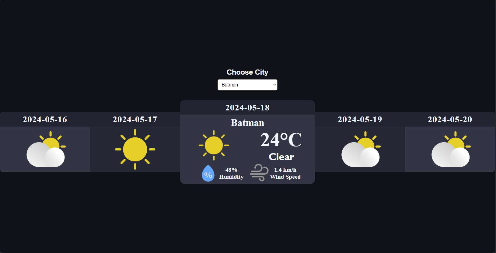

# React-Weather-App

This application allows you to view 5 day weather forecast for all cities in Turkey.

### Features

- Users can access the weather forecast for a different city through a dropdown menu.
- The forecast covers the upcoming 5days starting from the current day.
- Upon initial page load, default city location is Istanbul
- The current day is highlighted with a background and border.
- Each day card displays the date, weather condition image (sunny, rainy, snowy, cloudy), temperature, wind and humidity.

<video controls>
  <source src="preview.mp4" type="video/mp4">
  Your browser does not support the video tag.
</video>